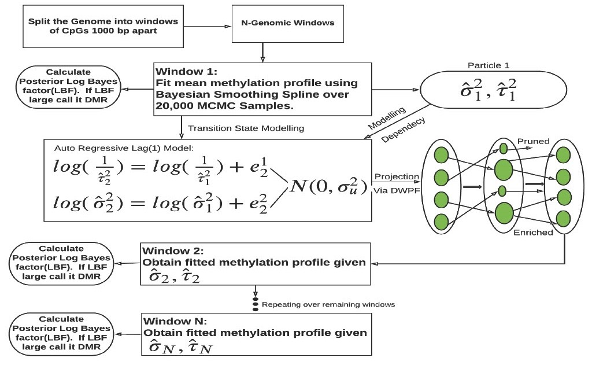

# BFDAMs: Bayesian Functional Data Analysis over Dependent Regions and Its Application for Identification of Differentially Methylated Regions.
# Methodological Pipeline


## Cotents
- [Overview](#Overview)
- [Usage](#Usage)
- [Arguments](#Arguments)
- [Values](#Values)
- [Examples](#Examples)
- [Contributions](#contributions)

## Overview
```
This repository contains 3 folders. 

R: 
contains the R scripts for replicating the simulation and real data results along with the figures in the manuscript.

Data: 
contains subset of two real data used in this study. Data1:  To download the full data please click on this link 

Man: 
contains the files and results from our analysis that will be taken in as input by few functions in the R filder for replicating the simulation and real data results along with the figures in the manuscript.
```

## Usage

```
BFDAM1: This function fits a Bayesian functional data analysis model by assuming the contiguous sequence of windows/regions are independent of each other while accounting for dependency of observations inside a particular window/region. 

BFDAM2: This function fits a Bayesian functional data analysis model by assuming the contiguous sequence of windows/regions are dependent of each other as well as accounting for dependency of observations inside a particular window/region.

```

## Arguments

```

Both our proposed functions BFDAM1 and BFDAM2 have the same set of arguments. These functions have 6 arguments. For example, to run the functions under their default settings the user can use the following:
Ex: fit = BFDAM1(x, iter = 20000, burn = 1000, seed = 1234, grplab1 = 'Normal', grplab2 = 'Tumor')
Ex: fit = BFDAM2(x, iter = 20000, burn = 1000, seed = 1234, grplab1 = 'Normal', grplab2 = 'Tumor')
### The table below details the required arguments:
| Parameter                 | Default       | Description   |	
| :------------------------ |:-------------:| :-------------|
| x	       |	           | A list which has 3 data frames (DF). 
The 1st DF (betavals) should contain the methylation data where rows are CpG sites and the columns are the methylation values from Group1 and Group2 samples. Note: The 1st column of this DF should be a column called 'windows' that should contain the information about each CpG site and to which window number it was assigned.
The 2nd DF (cpglocationdf) should contain the annotations of the CpGs obtained using the Illumina manifest file. 
The 3rd DF (windowinfo) should contain the information about the span (region start - end) of each genomic window created by the user.
| iter |      20000       | Number of MCMC iterations to be run
| burn |      1000       | Number of burn-ins
| seed |      1234       | A random number for reproducibilty of results
| grplab1 |      'Normal'       | Label for group 1 in methylation data frame/matrix
| grplab2 |      'Tumor'       | Label for group 2 in methylation data frame/matrix

```

## Values

```
### Both our proposed functions BFDAM1 and BFDAM2 return a data frame with the following values summarized in the table below.

| Object       | Description   |
| :------------------------ | :-------------|
| Method | Name of the method used among our 2 variants BFDAM1 or BFDAM2
| len.agg | Length of the user defined regions the model were run
| M1_Bayes | The Bayes factor values under model 1(No differential expression) for each window/region modeled
| M2_Bayes | The Bayes factor values under model 2(Differential expression) for each window/region modeled
| logBayes | The Log Bayes factor values obtained from the ratio of M1_Bayes/M2_Bayes for each window/region modeled
| predicted | The predicted status of each region using our models. Each window/region can be predicted as either DMR or Non-DMR.
| time.min | The time taken in minutes to model the windows/regions.


```


